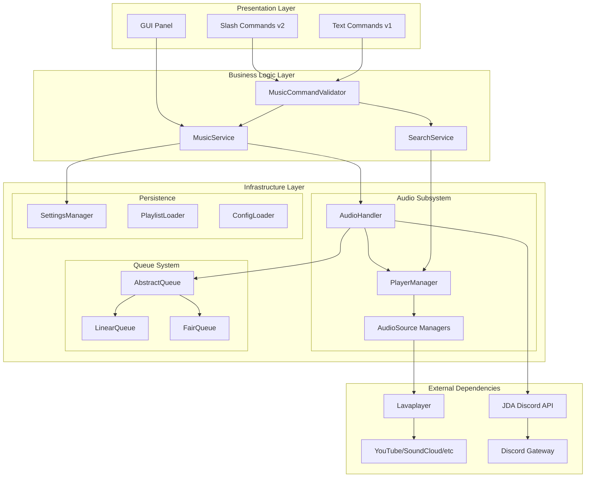
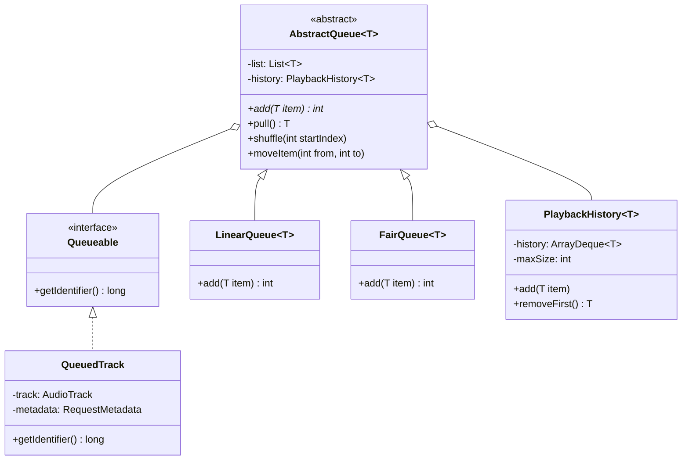
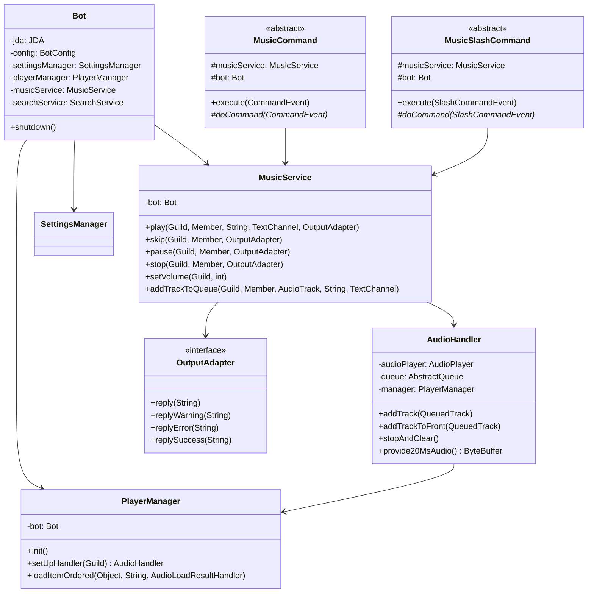
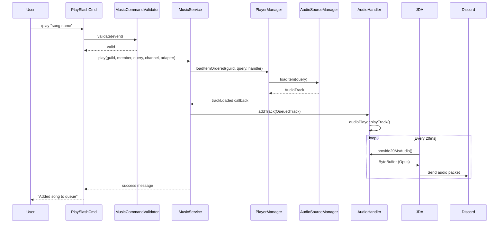

# JMusicBot Architectural Analysis

> **Document Metadata**
> | Field | Value |
> |-------|-------|
> | Generated | 2026-01-25 |
> | Branch | `slash-commands-v1` |
> | Commit | `c0f0a21` ([c0f0a214a50121a5b66ba28917a57013d9cb6a5f](https://github.com/arif-banai/MusicBot/commit/c0f0a214a50121a5b66ba28917a57013d9cb6a5f)) |
> | Version | `v0.6.1-21-gc0f0a21` (0.6.2-slash-commands) |
> | Base Commit Message | "Refactor music service and command structure" |

---

## Executive Summary

JMusicBot is a cross-platform Discord music bot built with Java 25, using JDA (Java Discord API) for Discord integration and Lavaplayer for audio streaming. The codebase follows a **layered architecture** with clear separation between presentation (commands), business logic (services), and infrastructure (audio/settings).

---

## High-Level Architecture Diagram



---

## Package Overview

### 1. Root Package: `com.jagrosh.jmusicbot`

| Class | Role |
|-------|------|
| `JMusicBot` | Application entry point, bootstraps all components |
| `Bot` | Central container holding references to all subsystems |
| `BotConfig` | Configuration loading and access facade |
| `DiscordService` | JDA initialization and Discord connection setup |
| `Listener` | Discord event handler (ready, voice updates, buttons) |

### 2. Commands Package: `commands.v1` and `commands.v2`

**Purpose**: Presentation layer handling user input via text commands (v1) or slash commands (v2).

**Hierarchy**:
```
Command (JDA-Utils)              SlashCommand (JDA-Utils)
    ├── MusicCommand                 ├── MusicSlashCommand
    │   └── DJCommand                │   └── DJSlashCommand
    ├── AdminCommand                 └── AdminSlashCommand
    └── OwnerCommand
```

**Key Classes**:
- `MusicCommand` / `MusicSlashCommand`: Base for music playback commands
- `DJCommand` / `DJSlashCommand`: Requires DJ role or permissions
- `AdminCommand` / `AdminSlashCommand`: Requires MANAGE_SERVER
- `CommandFactory`: Creates and registers all commands
- `SlashCommandRegistry`: Handles Discord slash command upsert with hash-based change detection

**Adapters**: `TextOutputAdapters` and `SlashOutputAdapters` implement `OutputAdapter` interface for command-agnostic responses.

### 3. Service Package: `service`

**Purpose**: Business logic layer encapsulating music operations.

| Service | Responsibilities |
|---------|------------------|
| `MusicService` | Player control, queue management, volume, repeat, seek, skip |
| `SearchService` | Track/playlist search with callback handling |
| `AudioLoadResultHandlers` | Async handlers for Lavaplayer load results |

**Key Design**: Services accept `OutputAdapter` to remain command-type agnostic.

### 4. Audio Package: `audio`

**Purpose**: Audio playback and Discord voice integration.

| Class | Role |
|-------|------|
| `PlayerManager` | Extends Lavaplayer's `DefaultAudioPlayerManager`, registers sources |
| `AudioHandler` | Per-guild audio handler, implements JDA's `AudioSendHandler` |
| `AudioSource` | Enum of audio sources (YouTube, SoundCloud, etc.) with registration logic |
| `QueuedTrack` | Wraps `AudioTrack` with request metadata |
| `RequestMetadata` | Stores requester info (user, channel, query) |
| `NowPlayingHandler` | Manages "now playing" message updates |
| `AloneInVoiceHandler` | Auto-disconnect when alone in voice channel |
| `TransformativeAudioSourceManager` | URL transformation via regex/CSS selectors |

### 5. Queue Package: `queue`

**Purpose**: Pluggable queue implementations.



**Strategy Pattern**: `QueueType` enum holds `QueueSupplier` references for runtime strategy selection.

### 6. Settings Package: `settings`

**Purpose**: Per-guild configuration persistence.

| Class | Role |
|-------|------|
| `Settings` | Per-guild settings POJO (volume, repeat, queue type, prefix, etc.) |
| `SettingsManager` | CRUD operations, JSON persistence (`serversettings.json`) |
| `QueueType` | Enum: LINEAR, FAIR with queue factory |
| `RepeatMode` | Enum: OFF, ALL, SINGLE |

**Persistence**: Jackson JSON serialization, auto-save on mutation.

### 7. Config Package: `config`

**Purpose**: Application configuration with versioned migration support.

| Subpackage | Responsibility |
|------------|----------------|
| `loader` | Loads and merges configs |
| `io` | File I/O operations |
| `migration` | Version migrations (0→1→...) |
| `model` | `ConfigOption` enum with type-safe accessors |
| `diagnostics` | Detects missing/deprecated keys |
| `validation` | Validates required fields (token, owner) |
| `render` | Generates updated config preserving template |
| `update` | Manages config file updates with backups |

---

## UML Class Diagram: Core Classes



---

## Design Patterns Identified

| Pattern | Location | Purpose |
|---------|----------|---------|
| **Strategy** | `QueueType` + `AbstractQueue` | Pluggable queue algorithms (Linear/Fair) |
| **Template Method** | `MusicCommand.execute()` → `doCommand()` | Common validation, subclass-specific logic |
| **Adapter** | `OutputAdapter` implementations | Unified output interface for text/slash commands |
| **Factory** | `CommandFactory`, `QueueSupplier` | Object creation encapsulation |
| **Observer** | `AudioEventAdapter` in `AudioHandler` | React to Lavaplayer track events |
| **Singleton-like** | `Bot`, `SettingsManager` | Single instance per application |
| **Registry** | `ConfigMigration`, `SlashCommandRegistry` | Centralized registration |
| **Facade** | `BotConfig`, `MusicService` | Simplified interface to complex subsystems |
| **Command** | JDA-Utils command framework | Encapsulated user requests |
| **Builder** | JDA's message builders | Fluent message construction |

---

## Data Flow: Playing a Track



---

## Implicit Architectural Decisions

### 1. Layered Architecture
- **Presentation**: Commands (v1/v2) handle user input
- **Business Logic**: Services contain domain operations
- **Infrastructure**: Audio, persistence, Discord integration

### 2. Command Version Separation
- `v1` = Text commands (legacy, prefix-based)
- `v2` = Slash commands (modern Discord UI)
- Both share `MusicService` and `OutputAdapter` abstraction

### 3. Per-Guild Isolation
- Each guild has its own `AudioHandler`, `Settings`, and queue
- No cross-guild state leakage

### 4. Configuration Versioning
- `meta.configVersion` enables forward-compatible migrations
- Backups created before updates

### 5. Event-Driven Audio
- Lavaplayer events drive track lifecycle
- `AudioHandler` extends `AudioEventAdapter` for hooks

### 6. Deferred Initialization
- `PlayerManager.init()` called after GUI to ensure logging is ready
- Audio sources registered at runtime based on config

---

## Improvement Opportunities

### 1. Reduce Service Coupling
**Issue**: `MusicService` (1192 lines) has too many responsibilities.
**Solution**: Extract sub-services:
- `QueueService` for queue operations
- `PlayerControlService` for play/pause/stop/seek
- `VolumeService` for volume management

### 2. Complete v2 Command Migration
**Issue**: v2 (slash commands) lacks Owner and General command categories.
**Solution**: Migrate remaining commands to slash versions for consistent UX.

### 3. Standardize Result Objects
**Issue**: Some methods return raw values, others return result objects.
**Solution**: Consistently use result objects (e.g., `OperationResult<T>`) for all service methods.

### 4. Extract Audio Source Registration
**Issue**: `AudioSource` enum contains complex registration logic.
**Solution**: Use a dedicated `AudioSourceRegistry` class with pluggable source providers.

### 5. Add Dependency Injection Framework
**Issue**: Manual dependency wiring in `Bot` constructor.
**Solution**: Consider lightweight DI (Guice, Dagger) for cleaner component management and testing.

### 6. Improve Test Coverage
**Issue**: Limited unit test infrastructure.
**Solution**: Add mocking for Discord/audio layers, increase coverage of service layer.

### 7. Configuration Hot-Reload
**Issue**: Config changes require restart.
**Solution**: Add file watcher for hot-reloading non-critical settings.

### 8. Unified Error Handling
**Issue**: Error handling varies across commands.
**Solution**: Create `CommandException` hierarchy with consistent handling in base classes.

---

## Technology Stack

| Component | Technology |
|-----------|------------|
| Language | Java 25 |
| Build | Maven 3.8+ |
| Discord API | JDA 6.3.0 |
| Command Framework | JDA-Chewtils 2.2.1 |
| Audio Playback | Lavaplayer 2.2.6 |
| YouTube Support | Lavalink YouTube Source 1.16.0 |
| Voice Protocol | JDave (DAVE protocol) |
| Native Audio | udpqueue (UDP audio queuing) |
| Configuration | Typesafe Config (HOCON) |
| Persistence | Jackson JSON |
| Logging | Logback + SLF4J |
| HTML Parsing | JSoup |
| Testing | JUnit 5, Mockito, Hamcrest |

---

## Startup Flow

```
main()
  └─> startBot()
       ├─> Create UserInteraction (Prompt)
       ├─> Redirect console streams (if GUI)
       ├─> Acquire instance lock
       ├─> Check versions
       ├─> Load BotConfig
       │    └─> Validate token & owner
       ├─> Set log level
       ├─> Create EventWaiter
       ├─> Create SettingsManager
       ├─> Create Bot instance
       │    ├─> Initialize PlaylistLoader
       │    ├─> Initialize PlayerManager (not init() yet)
       │    ├─> Initialize NowPlayingHandler
       │    ├─> Initialize AloneInVoiceHandler
       │    ├─> Initialize MusicService
       │    ├─> Initialize SearchService
       │    └─> Initialize YoutubeOauth2TokenHandler
       ├─> Initialize GUI (if enabled)
       ├─> Create CommandClient (via CommandFactory)
       ├─> Initialize PlayerManager (register audio sources)
       └─> Create JDA & connect to Discord
            └─> Register Listener for events
```

---

 ## Document History

This architectural analysis was generated using AI-assisted code analysis. To update this document after significant changes:

1. Review the current codebase structure for new packages/classes
2. Update diagrams to reflect new components or data flows
3. Add new design patterns if introduced
4. Update the metadata table at the top with the new commit info

**Regeneration command** (for reference):
```bash
git log -1 --format="%H %h %s %ai"
git describe --tags --always
```

---

*Last generated: 2026-01-25 | Commit: c0f0a21 | Branch: slash-commands-v1*
